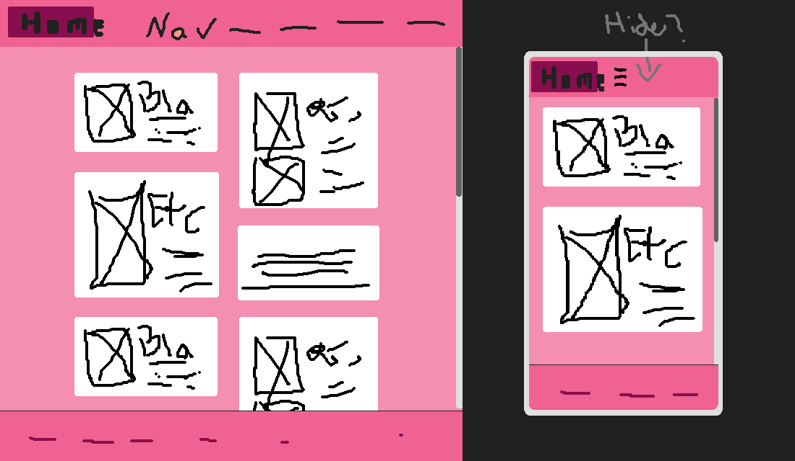

# Project 1: Fake blog -- dev log

## Prototyping

### Layout

All pages share the same header and footer. The header contains the logo/homepage link as well as the primary site navigation. If the vw is too small, a hamburger menu is used and either the whole header auto hides when scrolling down or only the hamburger icon is shown in a corner.

#### Homepage:
I want to go with a staggered card layout so that blog posts occupy more space when they are more recent/relevant/in-depth/important. Shorter posts should not contain a thumbnail, similar to how a newspaper handles short articles.

#### Blog post:
The blog article should have a maximum line length. Excess horizontal space is used to show meta information related to the article.
At the end of the article, users can either chronologically navigate to previous and following articles or an explicit list of similar articles is shown (although the mockup shows that in the sidebar, so maybe I'll do both).

### Responsiveness
To maximise readability, a line length of 50-75ch should be maintained while the vw is sufficient.
At least two breakpoints are needed to optimise layouts for mobile, tablet and desktop devices as per the requirements.
I am not sure how the layout needs to change to adapt to mid size screens (tablets).

## Requirements

### Structure
 - [x] homepage:
    - [x] nav
    - [x] blog post card(s)
    - [x] footer
 - [x] blog post
    - [ ] header
    - [ ] article meta (attribution, social links)
    - [ ] presumably the article itself

### Layout & Design
 - [x] Custom everything
 - [ ] Typography: 3 unique props per tag (h1, p (bold, italic, underlined), a, quote)
 - [x] At least 3 colours
 - [ ] Components: image+caption, button (pseudo), card
 - [ ] responsive (mobile, tablet, desktop breakpoints)

### Technical
 - [x] main.css contains three imported files
 - [x] use grid and flexbox twice each
 - [x] use semantic html
 - [ ] generic tags have a class or id
 - [ ] no trailing whitespace (sed)
 - [ ] avoid advanced css selectors

## Attribution
Icons curtosy of pictogrammers.com/google, licensed under Apache 2.0
https://github.com/Templarian/MaterialDesign
