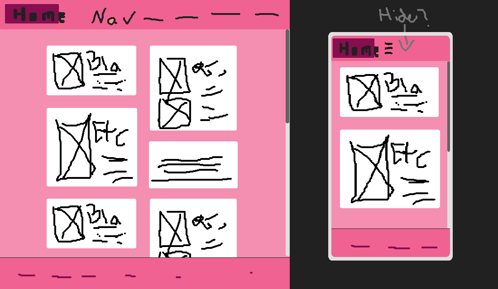
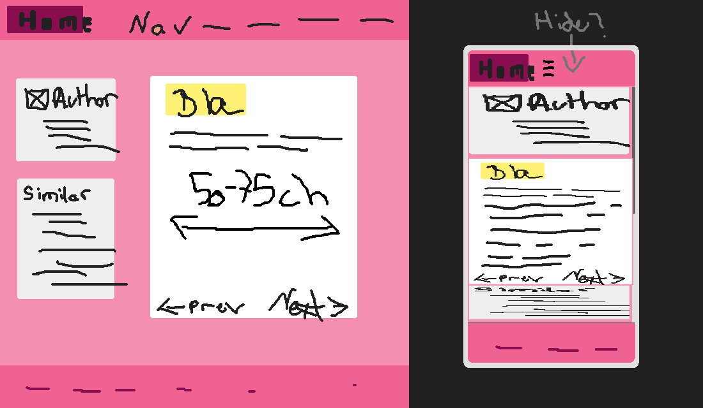

# Project 1: Fake blog -- dev log

## Prototyping

### Layout
Design-wise I want to go with a flex-box design (non-grid aligned 2d layout of blog cards), but I need to use 2 grids to meet the requirements. I suppose I could add something else that uses grid, like a calendar widget.

#### Mockups: 
Homepage:

Blog post:

### Responsiveness
To maximise readability, a line length of 50-75ch should be maintained while the vw is sufficient.
At least two breakpoints are needed to optimise layouts for mobile, tablet and desktop devices as per the requirements.
I am not sure how the layout needs to change to adapt to mid size screens (tablets).

## Requirements

### Structure
 - homepage:
    - nav
    - blog post card (presumably not the full article; contains card, image and buttons)
    - footer
 - blog post
    - header (why only mentioned here? Ought to be similar/identical to homepage)
    - article meta (author info, social)
    - presumably the article itself

### Layout & Design
 - Custom everything
 - Typography: 3 unique props per tag (h1, p (bold, italic, underlined), a, quote)
    - I'll use strong, em and del anyway.
 - At least 3 colours
 - Components: image+caption, button (pseudo), card
 - responsive (mobile, tablet, desktop)

### Technical
 - main.css contains three imported files
 - use grid and flexbox twice each
 - use semantic html
 - generic tags have a class or id
 - no trailing whitespace (sed)
 - avoid advanced css selectors

